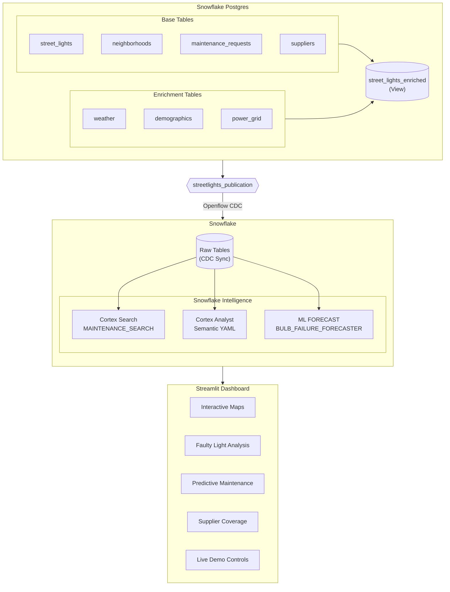

# Street Lights AI Maintenance Demo

[](https://opensource.org/licenses/Apache-2.0)
[](CITATION.cff)

## PostgreSQL/PostGIS → Snowflake Openflow → Snowflake Cortex Intelligence → ML FORECAST

Complete demo showcasing modern data pipeline with PostgreSQL/PostGIS, Snowflake Openflow CDC, and Snowflake Intelligence (Cortex Search + Cortex Analyst + ML FORECAST).

Features:
• Real-time Change Data Capture from PostgreSQL to Snowflake
• Semantic search on maintenance descriptions (Cortex Search)
• Natural language analytics (Cortex Analyst)
• ML-powered failure forecasting with budget/staffing recommendations
• Interactive Streamlit dashboard with spatial visualizations
• Production-ready architecture for smart city infrastructure

Tech Stack: PostgreSQL/PostGIS, Snowflake Openflow, Snowflake Intelligence, Streamlit, Folium
Use Case: Predictive maintenance for 5,000 street lights in Bengaluru

> [!CAUTION]
> **DISCLAIMER**: This project uses entirely fictitious data for demonstration and educational purposes. All company names, supplier names, contact information, and other data are computer-generated and do not represent real entities.

---

## 🎬 Demo Video

[](https://youtu.be/fbCA06cdUTU)

See the complete end-to-end demo showcasing PostGIS, Snowflake Openflow CDC, and Snowflake Intelligence in action.

---

## Quick Start

**See [QUICKSTART.md](QUICKSTART.md) for the complete setup guide.**

The quickstart covers:

1. Prerequisites and tool installation
2. Snowflake-managed PostgreSQL setup via Snowsight
3. Database initialization and data loading
4. Streamlit dashboard launch
5. Snowflake CDC configuration
6. Snowflake Intelligence (Cortex Search + Cortex Analyst) setup and configuration
7. Snowflake ML Forecasting setup and configuration

---

## Prerequisites

| Tool | Purpose | Installation |
|------|---------|--------------|
| **Snowflake Account** | Database, CDC, ML, and AI capabilities | [Sign up](https://signup.snowflake.com/) |
| **Snowflake CLI** | Execute SQL and manage resources | [Docs](https://docs.snowflake.com/en/developer-guide/snowflake-cli/index) |
| **psql** | PostgreSQL command-line client | `brew install libpq` (macOS) |
| **Python 3.12+** | Dashboard and data generation | [python.org](https://www.python.org/) |
| **uv** | Python package manager | `curl -LsSf https://astral.sh/uv/install.sh \| sh` |

> [!TIP]
> Use [~/.pgpass](https://www.postgresql.org/docs/current/libpq-pgpass.html) for secure Snowflake PostgreSQL credentials:
>
> ```
> <host>:5432:postgres:snowflake_admin:<password>
> ```

---

## Architecture



---

## Database Schema

### Base Tables

| Table | Description |
|-------|-------------|
| `neighborhoods` | Geographic boundaries (polygons) with population data |
| `street_lights` | Operational data (location, status, installation date) |
| `maintenance_requests` | Historical maintenance records |
| `suppliers` | Equipment suppliers with service coverage |

### Enrichment Tables

| Table | Description |
|-------|-------------|
| `weather_enrichment` | Seasonal patterns with failure risk scores |
| `demographics_enrichment` | Neighborhood characteristics |
| `power_grid_enrichment` | Electrical grid data per light |

### Key View

- **`street_lights_enriched`**: Combines lights with all enrichment data (main CDC view)

See [SCHEMA_REFERENCE.md](SCHEMA_REFERENCE.md) for complete schema documentation.

---

## Data Generation

Generate data using `uv run` commands:

```bash
# Install dependencies first
uv sync

# Generate full dataset (5,000 lights, 50 neighborhoods, 1,500 maintenance requests)
uv run generate-all-data

# Generate sample dataset for quick testing (10 lights, 5 neighborhoods)
uv run generate-sample
```

### Dataset Sizes

| Entity | Full Dataset | Sample Dataset |
|--------|--------------|----------------|
| Street lights | 5,000 | 10 |
| Neighborhoods | 50 | 5 |
| Suppliers | 25 | 3 |
| Maintenance requests | 1,500 | 10 |
| Enrichment records | 15,000 | 30 |

**Status distribution**: 85% operational, 10% maintenance required, 5% faulty

---

## Key Features

### PostGIS Spatial Operations

- Sub-second spatial queries (ST_Within, ST_DWithin, ST_Distance)
- GIST indexes for performance
- Point-in-polygon, proximity search, nearest neighbor
- Geography type for accurate meter-based distances

### Snowflake Openflow CDC

- Real-time change data capture from PostgreSQL
- Automatic schema synchronization
- ~1-5 second sync latency
- Setup guide: [Getting Started with Openflow PostgreSQL CDC](https://quickstarts.snowflake.com/guide/getting-started-with-openflow-postgresql-cdc/)

### Snowflake Intelligence

- **Cortex Search**: Semantic search on maintenance descriptions
- **Cortex Analyst**: Structured analytics via YAML semantic model
- Natural language queries for both search and analytics
- Setup guide: [Getting Started with Snowflake Intelligence](https://www.snowflake.com/en/developers/guides/getting-started-with-snowflake-intelligence/)

**Recommended Orchestration Instructions:**

```
## ROUTING RULES - CRITICAL

Use CORTEX SEARCH (MAINTENANCE_SEARCH) for questions about:
- Finding issues by description: "flickering", "sparking", "exposed wires", "water damage"
- Safety hazards, dangerous situations, urgent repairs
- Semantic similarity: "find issues similar to...", "show me complaints about..."
- Free-text content in maintenance descriptions

Use CORTEX ANALYST (semantic model) for questions about:
- Counts and aggregations: "how many", "total", "average"
- Rankings: "which neighborhoods have the most..."
- Status breakdowns: "lights by status", "open vs closed requests"
- Time-based analytics: resolution times, trends

## OUTPUT & ORCHESTRATION GUIDELINES

1. DATA VISUALIZATION
- Prioritize Graphics: Whenever the result set structure permits, visualize the data graphically (charts, graphs, plots) rather than outputting raw tabular text.

2. FINANCIAL FORMATTING
- Currency Standard: All monetary values must be converted and displayed in Indian Rupees (INR / ₹).

3. LOCATION & GEOSPATIAL HANDLING (CRITICAL)
- WKT Parsing: If the query result contains location data in WKT (Well-Known Text) format, parse the geometry to extract Latitude and Longitude.
- Error Suppression: Handle all parsing logic internally. Do NOT expose SQL parsing errors or code stack traces to the end user.
- Map Link Generation: Construct a Google Maps URL using extracted coordinates (e.g., https://www.google.com/maps/search/?api=1&query=LAT,LONG).
- Display Logic:
  * Hide Raw Coordinates: Never display raw Latitude and Longitude values in the final response.
  * Anchor Text Rule: Use the specific Place Name from the data record as the hyperlink text.
  * Fallback: If the Place Name is unavailable, use the text "Show in Maps" as the hyperlink anchor.
```

> [!NOTE]
> [WKT (Well-Known Text)](https://en.wikipedia.org/wiki/Well-known_text_representation_of_geometry) is a standard format for geometry like `POINT(77.5946 12.9716)`.

### ML Forecasting

- Time-series forecasting for bulb failures
- 30/90-day predictions with confidence intervals
- Budget planning with cost breakdowns (INR)
- Seasonal risk analysis

---

## Documentation

| Document | Purpose |
|----------|---------|
| [QUICKSTART.md](QUICKSTART.md) | Complete setup guide |
| [SCHEMA_REFERENCE.md](SCHEMA_REFERENCE.md) | Database schema, tables, views, and query patterns |
| [DEMO_SCRIPT.md](DEMO_SCRIPT.md) | Detailed demo walkthrough |
| [snowflake/SNOWFLAKE_INTELLIGENCE_QUESTIONS.md](snowflake/SNOWFLAKE_INTELLIGENCE_QUESTIONS.md) | Sample Cortex queries |
| [work/snowflake_ml_guide.md](work/snowflake_ml_guide.md) | ML forecasting details |

---

## Troubleshooting

### psql connection fails

```bash
# Verify environment variables
source .env
echo $PGHOST $PGPORT $PGDATABASE

# Test connection
psql -c "SELECT 1;"
```

### Snow CLI issues

```bash
# Check version
snow --version

# Test connection
snow connection test

# List connections
snow connection list
```

### Dashboard won't start

```bash
# Ensure dependencies installed
uv sync

# Check .env file exists with correct values
cat .env

# Run dashboard
uv run dashboard
```

### CDC not syncing

```bash
# Verify publication exists
psql -c "SELECT * FROM pg_publication;"

# Check replication slot
psql -c "SELECT * FROM pg_replication_slots;"
```

---

## License

This project is licensed under the Apache License 2.0 - see the [LICENSE](LICENSE) file for details.

Copyright 2025 Kamesh Sampath

See [NOTICE](NOTICE) for third-party attributions.

### Citation

If you use this project in your research or work, please cite it using the information in [CITATION.cff](CITATION.cff).

---

## Acknowledgments

- PostGIS for spatial database capabilities
- Snowflake Openflow for CDC capabilities
- Snowflake for AI Data Cloud
- Streamlit for rapid dashboard development

---

**Built for the spatial data community**
